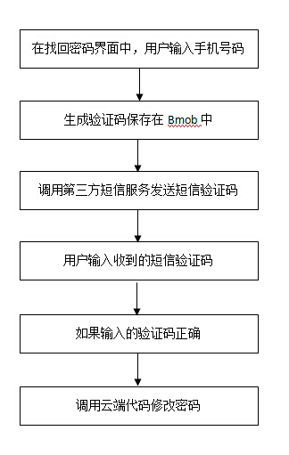

# 如何开发找回密码的功能
===================

很多开发者朋友在使用Bmob后端云的时候都会遇到一个问题：如何开发找回密码的功能？

大家都知道，基于安全的考虑，Bmob并不会直接给大家提供修改密码的功能，也就是说只有通过登录获得了sessionToken信息之后，才能进行修改密码的操作。但这个API并不适合找回密码的功能开发，因为用户就是忘记了密码，所以才无法登录进行操作。那么，应该怎么基于Bmob开发找回密码的功能呢？下面以手机短信的思路说明整个解决思路（见下面的流程图）。



这里需要说明的是:

- 保存在Bmob中的验证码信息可以是非常简单的方式，比如用一个验证码表，包含2个字段，分别是手机号、生成的验证码，这样就可以根据系统的默认字段`createdAt`和业务逻辑，判断验证码是否正确和是否过期。
- 之所以用到云端代码，是因为只有通过masterKey才能不需要登录（即sessionToken）就可以修改密码，而我们一般不会把masterKey信息放在SDK端中，因此，通过调用云端代码，通过云端代码来使用masterKey去修改密码的方式，会让整个过程变得更加安全。为方便大家将来直接使用，我们提供了这段云端代码的参考代码（SDK端上传phone和password信息）。

```
function onRequest(request, response, modules) {
    var username = request.body.phone;//手机号码，本案例中也是用户名信息
    var pwd = request.body.password;//新密码
    var db = modules.oData;
    db.find({
        "table":"_User",
        "where":{"username":username},
    },function(err,data){
        if(data){
            var resultObject= JSON.parse(data);
            var objectId = resultObject.results[0].objectId;
            db.setHeader({"X-Bmob-Master-Key":"这里替换为你的APP的masterkey信息"});
            db.updateUserByObjectId({"objectId":objectId, data:{"password":pwd}},function(err,data){
                response.end("更新成功");
            });
        }
    });
}    

``` 
